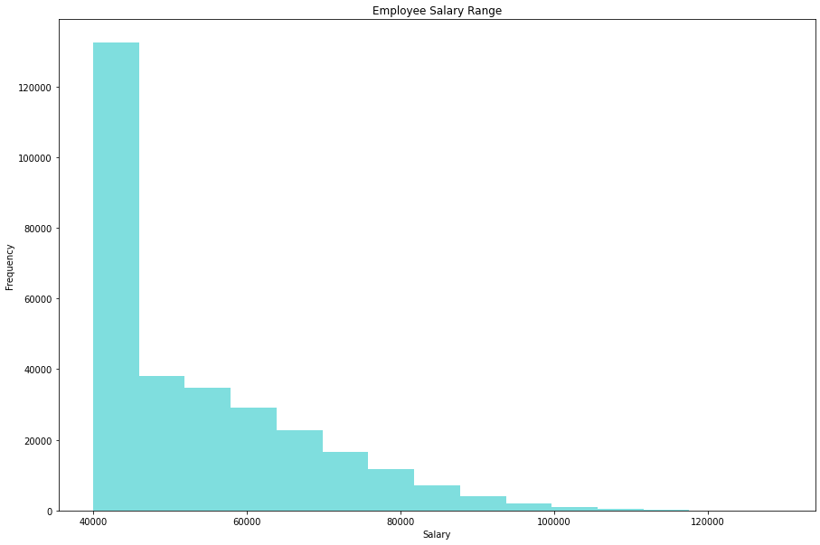

# HP Employee Analysis

## Background

Analyzing HP employee data to extract relevant information to understand department and employee metrics.

#### Data Modeling

* Inspect the CSVs and sketch out an ERD of the tables.

#### Data Engineering

* Created six relational tables within pgAdmin housing HP employee data

[schemas](EmployeeSQL/tables.sql)

#### Data Analysis

 * Performed data modeling and data analysis on the data using SQL queries in Python.
 
 [queries](Connecting to Database/main.ipynb)
 
#### Data Exploration & Visualization

 * Using SQLAlchemy and Pandas to connect to Postgres database and visualize employee information

* Histogram

* Bar Chart

## References

Mockaroo, LLC. (2021). Realistic Data Generator. [https://www.mockaroo.com/](https://www.mockaroo.com/)
