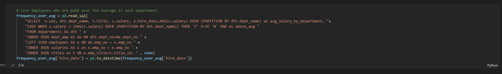
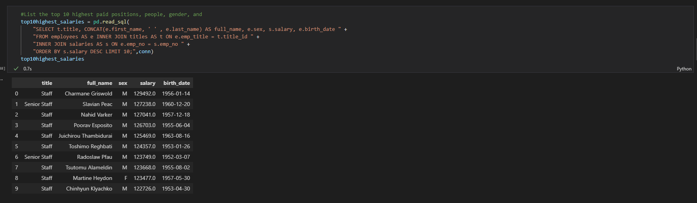

# HP Employee Analysis

## Background

Analyzing HP employee data to extract relevant information to understand department and employee metrics.

#### Data Modeling

* Inspect the CSVs and sketch out an ERD of the tables.

#### Data Engineering

* Created six relational tables within pgAdmin housing HP employee data

[schemas](EmployeeSQL/tables.sql)

#### Data Analysis

 * Performed data modeling and data analysis on the data using SQL queries in Python.
 
 [queries](Connecting to Database/main.ipynb)
 
#### Data Exploration & Visualization

 * Using SQLAlchemy and Pandas to connect to Postgres database and visualize employee information

* Bar Charts

#### Frequency of Sex, by Department and Sex in 1980s and 1990s

##### It seems that in 1980s and 1990s the most frequency of Males is 4847 and for the most females is 3305 in the Development department. Also, in 1980s there is a greater total increase of hires for both Males and Females however, hiring rate percentages between 1980s and 1990s of stayed relatively the same with Males (60%) and Females (40%) in each department.

#### Top 10 Highest and Lowest Paid Positions, People, and Gender

##### It seems that the highest paid position is Staff with a salary of $129492 and the lowest paid position is tied between Enginner, Staff, Senior Engineer, and Technique Leader with a salary of $40000.

* Bar Chart

## References

Mockaroo, LLC. (2021). Realistic Data Generator. [https://www.mockaroo.com/](https://www.mockaroo.com/)
