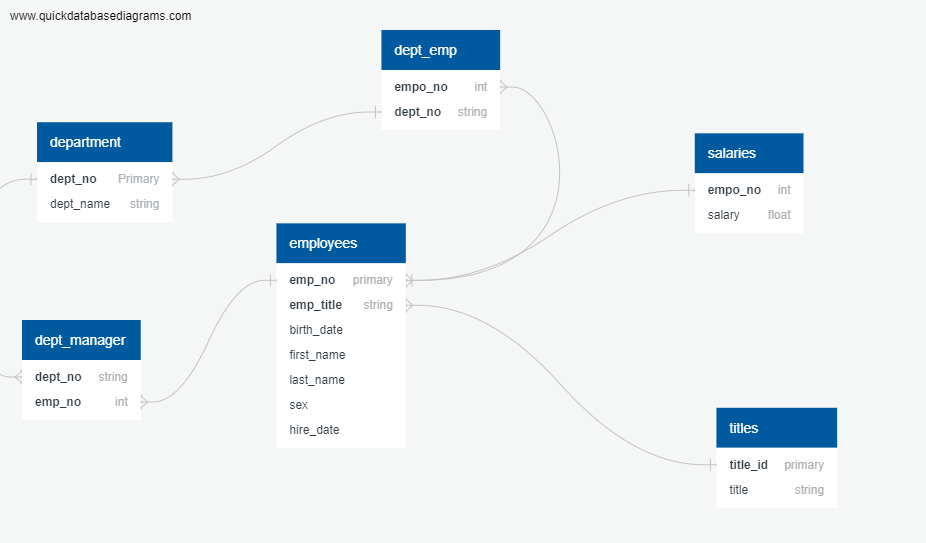
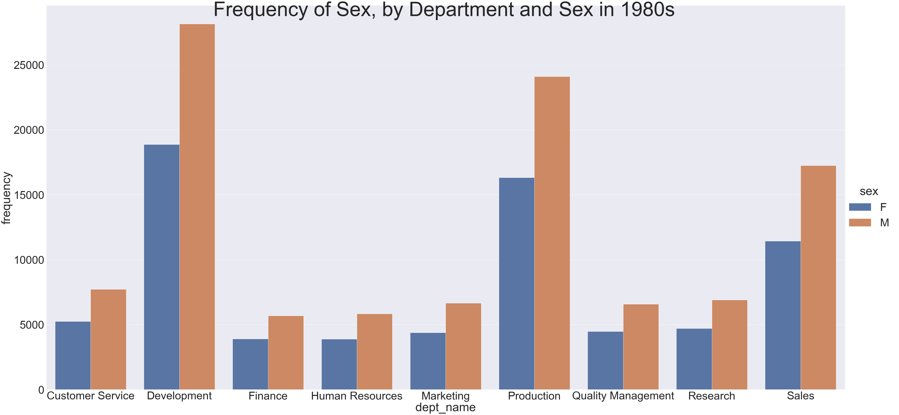
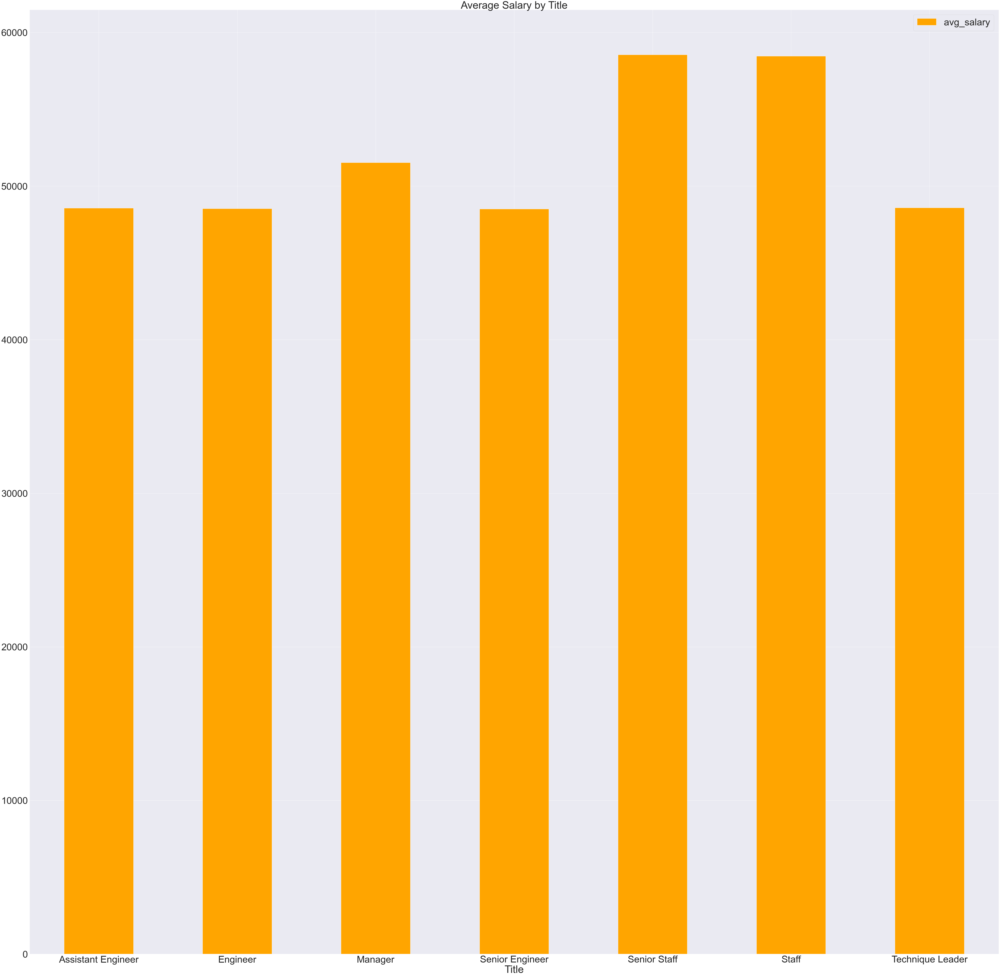
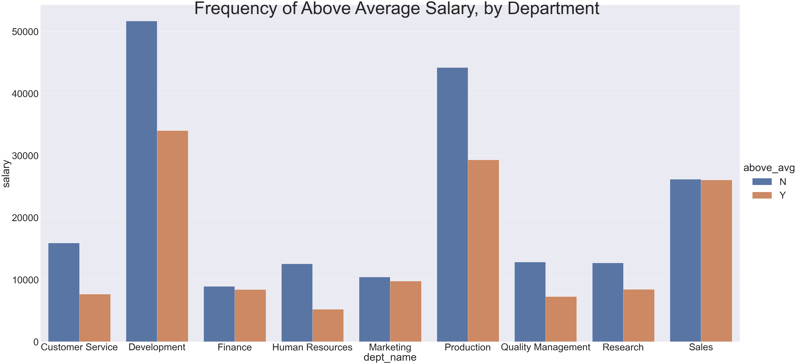
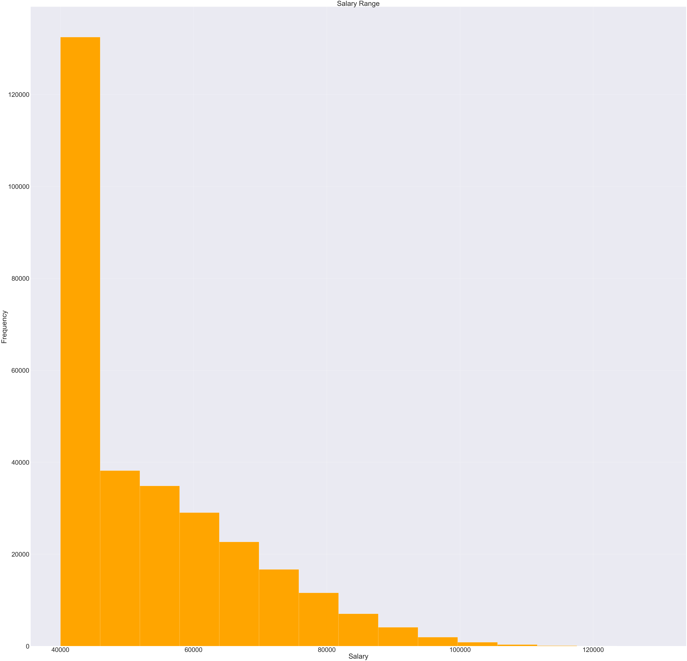
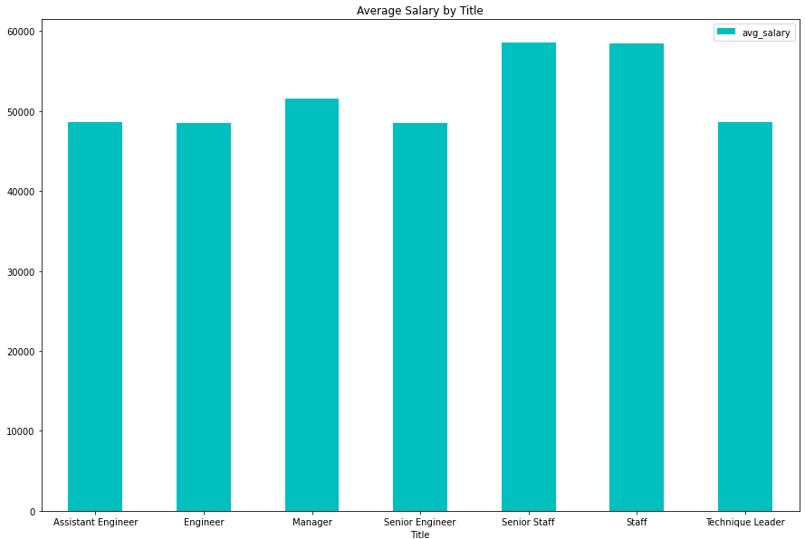

# HP Employee Analysis

## Background

Analyzing HP employee data to extract relevant information to understand department and employee metrics.

#### Data Modeling

* Inspect the CSVs and sketch out an ERD of the tables.

#### Data Engineering

* Created six relational tables within pgAdmin housing HP employee data

[schemas](EmployeeSQL/tables.sql)

#### Data Analysis

 * Performed data modeling and data analysis on the data using SQL queries in Python.
 
 [queries](Connecting to Database/main.ipynb)
 
#### Data Exploration & Visualization

 * Using SQLAlchemy and Pandas to connect to Postgres database and visualize employee information

* Bar Charts

#### <u>Frequency of Above Average Salary, by Department</u>

##### The bar graph shows that a majority of employees in the Customer Service, Development, Human Resources, Production, Quality Management, Research departments are paid below average salary. However, in Marketings and Sales there seems to be an even number of employees paid above and below average.

* Bar Chart

## References

Mockaroo, LLC. (2021). Realistic Data Generator. [https://www.mockaroo.com/](https://www.mockaroo.com/)
